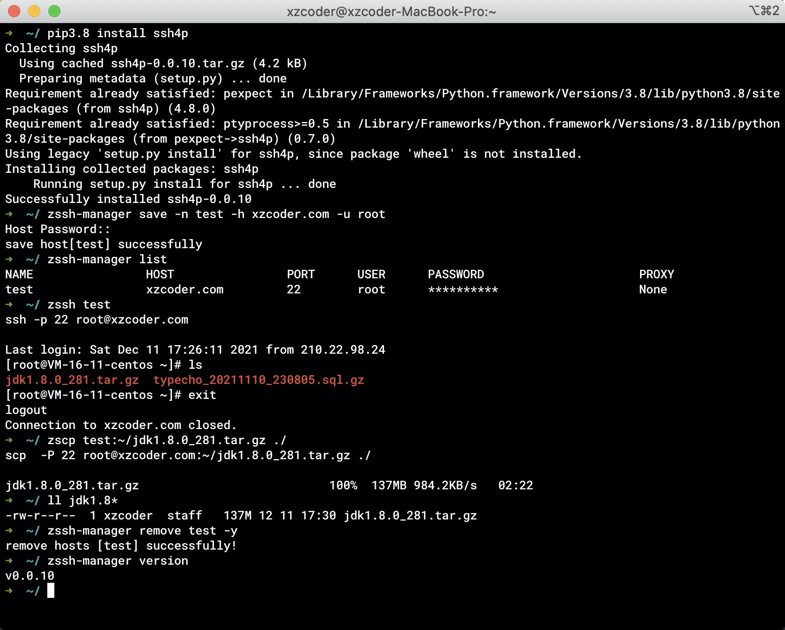

# ssh4p
a shell ssh manager tools for python

## Install
```shell script
# add python3 to path
pip3 install ssh4p
```

## Quick Start
```shell script
# add a host config
zssh-manager save -n test -h 1.1.1.1 -u root
# show all host
zssh-manager list [-p --password]
# remove host
zssh-manager remove [host_name] [-y --yes]
# batch edit host config
zssh-manager edit [-a --application "default vim"]
# start ssh session
zssh host_name
# start scp transfer
zscp remote_host_name:file_path local_host_path [-r]
zscp local_host_file_path remote_host_name:file_path [-r]
```


# Author
> author: xzcoder  
> mail: zhushuai_it@163.com  
> home: https://xzcoder.com  